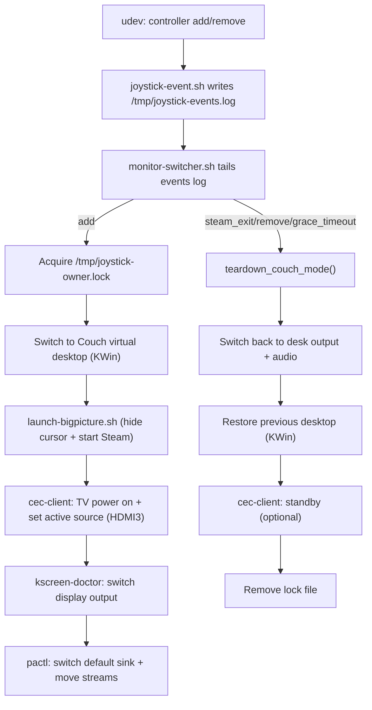

# joystick-notify

Controller-driven “couch mode” automation for KDE Plasma (Wayland): switch to a dedicated desktop, hide the cursor, start Steam Big Picture, wake the TV and switch it to the PC’s HDMI input via CEC, then move video + audio output to the TV. When couch mode ends, restore desk output first, then restore the previous desktop, and optionally put the TV into standby.

This folder contains everything needed to install the workflow:
- Scripts installed into `/usr/local/bin`
- udev rules in `/etc/udev/rules.d`
- systemd **user** units in `~/.config/systemd/user`
- Optional tray icon service

## High-level flow



## Components (by file)

### `scripts/joystick-event.sh`
Runs as root via udev and appends a single line per event to:
- **`/tmp/joystick-events.log`** (mode `666`)

It also ensures the flock lock is usable from both root (udev) and your user service:
- **`/tmp/joystick-events.lock`** (mode `666`)

Log format:
```
<ISO-8601> <add|remove|...> <device-id>
```

Device id is an opaque identifier; typically:
- Bluetooth: `HID_UNIQ` (MAC)
- Some USB cases: `eventNN`

### `scripts/monitor-switcher.sh`
Long-running user service that tails `/tmp/joystick-events.log` and drives the workflow.

Key concepts:
- **Owner lock**: `/tmp/joystick-owner.lock` contains the “owner” device id (first controller to connect).
- **Grace period**: disconnects are debounced to avoid tearing down on brief Bluetooth hiccups.
- **Synthetic events**: internal timers/watchers emit events back into the same log stream (e.g. `grace_timeout`, `steam_exit`) using a reliable append.
- **KWin virtual desktop isolation**:
  - Saves current desktop to `/tmp/joystick-prev-desktop.$UID`
  - Switches to a desktop named `Couch` (or `COUCH_DESKTOP_NUM`)
  - Restores the previous desktop on teardown (after switching outputs back to desk)
- **CEC** (libcec):
  - Uses `cec-client -p <port>` (your port is HDMI3 by default)
  - Wakes TV and switches input on connect; optionally sends TV standby on teardown

Logs:
- **`/tmp/joystick-watcher.log`**: monitor-switcher internal log
- **`/tmp/joystick-events.log`**: raw event stream (udev + synthetic)

### `scripts/launch-bigpicture.sh`
Starts Steam Big Picture in a way that works well on Plasma Wayland and manages cursor hiding:
- Enables KWin “Hide Cursor” effect (best-effort) at startup
- Restores the user’s previous KWin cursor settings on exit
- Starts Steam:
  - If already running: `steam://open/bigpicture`
  - Otherwise: `steam -gamepadui`
- Stays alive while `/tmp/joystick-owner.lock` exists so cursor hiding remains active

### `udev/99-joystick-notify.rules`
Triggers `joystick-event.sh` on controller connect/disconnect.

Notable behaviors:
- Prefers Bluetooth HID events using `HID_UNIQ` (stable across `/dev/input/eventN` churn).
- Includes optional rules for:
  - Ignoring legacy `js*` nodes for Xbox Wireless Controller (keeps evdev usable).
  - Loading `xpad` and binding IDs for an 8BitDo receiver.
  - Triggering USB joystick events for a specific 8BitDo dongle via `event*`.

### `udev/71-8bitdo-controllers.rules`
Misc device-specific tweaks (permissions / power settings) for certain controllers.

### `systemd/joystick-notify.service`
Main **systemd user service** that runs `monitor-switcher.sh`.

Highlights:
- Waits for PipeWire/Pulse to be ready (via `pactl info`).
- Sets user-session env vars (`XDG_RUNTIME_DIR`, `DBUS_SESSION_BUS_ADDRESS`).
- On service stop, runs `ExecStopPost` to revert audio/display and remove the lock file.

### `systemd/joystick-notify-steam-shutdown.path` and `.service`
Watches `/tmp/joystick-owner.lock` changes. When couch mode ends (lock disappears) it runs a oneshot that attempts to shut down Steam.

Important detail:
- The service is guarded so it only calls `steam -shutdown` if Steam is already running (prevents “spawn Steam just to shut it down”).

### `systemd/joystick-notify-tray.service`, `system-tray/joystick-tray.py`, `system-tray/joystick-notify-tray.desktop`
Optional tray icon (PyQt6) to start/stop/restart the user service and open recent logs.

## Installation

Run as your normal user (installer uses `sudo` only for root-owned locations):

```bash
./install.sh
```

To install without enabling/starting services:

```bash
./install.sh --no-enable
```

The installer copies:
- Scripts → `/usr/local/bin/`
- udev rules → `/etc/udev/rules.d/`
- systemd user units → `~/.config/systemd/user/`
- desktop entry → `~/.local/share/applications/`

## Dependencies

Required (core workflow):
- `bash`
- `systemd` user services
- KDE Plasma (Wayland) with:
  - `qdbus6`
  - `kreadconfig6` / `kwriteconfig6`
  - `kscreen-doctor`
- PipeWire/Pulse compatibility: `pactl`
- Notifications: `notify-send` (optional; best-effort)
- Steam: `steam`

CEC (recommended):
- `cec-client` (libcec)
  - Ensure your user can access the adapter device (typically `/dev/ttyACM0`). On many systems this means being in the `uucp` group and re-logging in.

Tray icon (optional):
- `python3`
- `PyQt6`

## Configuration

Configuration is via environment variables (set them in your systemd user unit via a drop-in).

Main behavior:
- `DEBUG_MODE=false`: if true, avoids real actions and only logs/notifies
- `DISCONNECT_GRACE=15`: seconds to wait before tearing down after disconnect (when Steam is running)
- `STEAM_POLL=2`: seconds between Steam exit checks

Virtual desktop:
- `COUCH_DESKTOP_NAME=Couch`
- `COUCH_DESKTOP_NUM=` (optional override; if set, name lookup is skipped)

CEC:
- `CEC_ENABLED=true`
- `CEC_HDMI_PORT=3` (your PC input)
- `CEC_POWER_OFF_ON_TEARDOWN=true`

Audio:
- `HEADSET_SINK=...` (in script; can be edited or you can patch to env)
- TV sink auto-detection uses:
  - `TV_ALSA_CARD` (default `2`)
  - `TV_ALSA_DEVICE` (default `9`)
  - optional `TV_SINK` override

Example drop-in:

```ini
[Service]
Environment=DISCONNECT_GRACE=15
Environment=COUCH_DESKTOP_NAME=Couch
Environment=CEC_HDMI_PORT=3
Environment=CEC_POWER_OFF_ON_TEARDOWN=true
```

Apply:
```bash
systemctl --user daemon-reload
systemctl --user restart joystick-notify.service
```

## How to test pieces manually

### CEC: switch input to HDMI3 (often also powers on the TV)
```bash
printf 'as\nis\nas\nis\nas\nis\nq\n' | cec-client -s -d 1 -p 3
```

### CEC: standby (power off)
```bash
printf 'standby 0\nq\n' | cec-client -s -d 1 -p 3
```

### Observe the automation logs
```bash
tail -f /tmp/joystick-watcher.log
tail -f /tmp/joystick-events.log
```

## Troubleshooting

- **TV doesn’t power on or switch input**
  - Confirm `cec-client` works manually (see commands above).
  - Confirm your user can read/write the adapter (commonly `/dev/ttyACM0`). If it is `root:uucp`, ensure your user is in `uucp` and you have re-logged in.

- **Couch desktop doesn’t switch**
  - Ensure you have a virtual desktop named exactly `Couch` in Plasma settings, or set `COUCH_DESKTOP_NUM`.
  - Confirm DBus works: `qdbus6 org.kde.KWin /KWin org.kde.KWin.currentDesktop`.

- **Random teardown on brief controller hiccups**
  - Increase `DISCONNECT_GRACE`.

- **Notifications cause crashes / rate limiting**
  - Notifications are best-effort and coalesced; if you still see issues, you can disable notifications by removing/adjusting calls to `note()` in `monitor-switcher.sh`.

- **Steam “starts then immediately exits” on teardown**
  - Ensure you’re using the updated `joystick-notify-steam-shutdown.service` which only calls `steam -shutdown` when Steam is actually running.

## Uninstall

Systemd user units:
```bash
systemctl --user disable --now joystick-notify.service joystick-notify-steam-shutdown.path joystick-notify-tray.service 2>/dev/null || true
rm -f ~/.config/systemd/user/joystick-notify.service \
      ~/.config/systemd/user/joystick-notify-steam-shutdown.service \
      ~/.config/systemd/user/joystick-notify-steam-shutdown.path \
      ~/.config/systemd/user/joystick-notify-tray.service
systemctl --user daemon-reload
```

Installed binaries:
```bash
sudo rm -f /usr/local/bin/monitor-switcher.sh \
           /usr/local/bin/joystick-event.sh \
           /usr/local/bin/launch-bigpicture.sh \
           /usr/local/bin/joystick-notify-tray
```

udev rules:
```bash
sudo rm -f /etc/udev/rules.d/99-joystick-notify.rules /etc/udev/rules.d/71-8bitdo-controllers.rules
sudo udevadm control --reload-rules
```

Runtime files:
```bash
rm -f /tmp/joystick-events.log /tmp/joystick-events.lock /tmp/joystick-owner.lock /tmp/joystick-watcher.log
```

